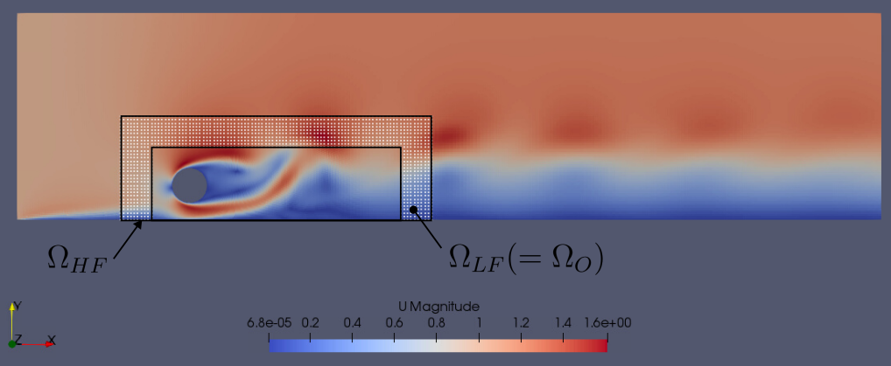

## Domain decomposition reduced-order modeling of incompressible flow
Zonal approach for coupling CFD simulation (OpenFOAM) and Galerkin-free ROM (Python) [[1]](#1) using preCICE [[2]](#2).

## Workflow
In order to perform the coupled simulation, the following order of directories must be followed:
1. `run.simulation_snapshots` - OpenFOAM case directory for data generation to be used in the subsequent steps.
2. `pod` - Performs snapshot POD on the snapshot data generated in the previous step.
3. `run.precice.overlap` - Contains the high- and low-fidelity components; performs the zonal coupled simulation.
Refer the README in each directory for more information.

## Simuation domain and subdomains for coupling

**Figure**: The instantaneous velocity magnitude at $t=150$ obtained from the simulation in the case directory `run.simulation_snapshots` is shown in the background. 
The subdomains for the coupled simulation to be performed in the directory `run.precice.overlap` are also indicated.
The point cloud represents the sampling location of the snapshot data generation.
Refer [[1]](#1) for more information on subdomains.

NOTE: As shown in the figure, this case considers the low fidelity domains to be exactly same as the overlap domain, $\Omega_{LF} = \Omega_{O}$.

## Requirements
- preCICE [2.4.0](https://github.com/precice/precice/releases/tag/v2.4.0)
- OpenFOAM [6](https://openfoam.org/download/6-linux/)
- Python [3.10.8](https://www.python.org/downloads/release/python-3108/)
- preCICE OpenFOAM adapter [1.2.0 -- forked repo](https://github.com/nish-ant/openfoam-adapter)
- pyprecice [2.4.0.0](https://pypi.org/project/pyprecice/2.4.0.0/)
- parallel-pod [forked repo](https://github.com/nish-ant/parallel-pod)
- Open MPI [4.1.1](https://www.open-mpi.org/software/ompi/v4.1/)
- mpi4py [3.1.1](https://pypi.org/project/mpi4py/3.1.1/)
- jq [1.6](https://github.com/jqlang/jq/releases/tag/jq-1.6)

NOTE: `preciceFoam` appearing in the slurm scripts refers to the name of the spack environment used to [install preCICE](https://precice.org/installation-spack.html#installing-precice) and dependencies.

## References
<a id="1">[1]</a> 
Bergmann, M., Ferrero, A., Iollo, A., Lombardi, E., Scardigli, A., & Telib, H. ([2018](https://doi.org/10.1016/j.jcp.2017.10.001)). A zonal Galerkin-free POD model for incompressible flows. Journal of Computational Physics, 352, 301-325.

<a id="2">[2]</a> 
Bungartz, H.J., Lindner, F., Gatzhammer, B., Mehl, M., Scheufele, K., Shukaev, A. & Uekermann, B. ([2016](http://dx.doi.org/10.1016%2Fj.compfluid.2016.04.003)). preCICE–a fully parallel library for multi-physics surface coupling. Computers & Fluids, 141, 250-258.