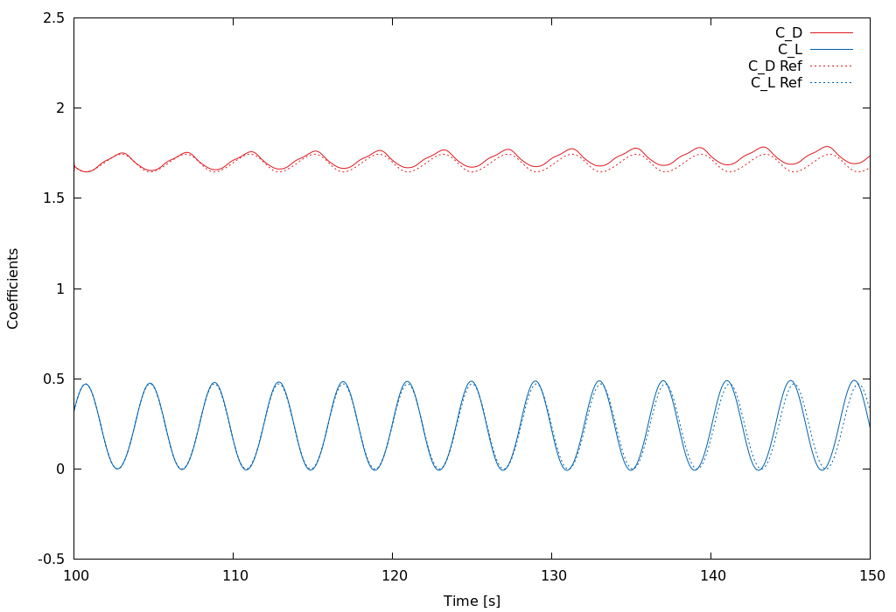

## About
- `hf-openfoam` Performs high-fidelity CFD part of the coupled simulation -- OpenFOAM based incompressible solver.
- `lf-galfree` Performs low-fidelity ROM part of the coupled simulation -- Python based Galerkin-free approach.

## Sequence of submitting slurm scripts
```sh
cd hf-openfoam
sbatch runscript.preprocess         #- setup case, meshing, mapping
cd ..
sbatch runscript.of-py.sh           #- run the coupled simulation
```

## Result


**Figure**: Comparison of the lift and drag coefficients for the reference (dashed) and coupled (solid) simulations.
The couling window is between $t=100$ and $t=150$.